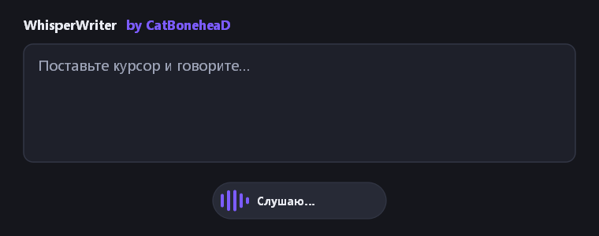
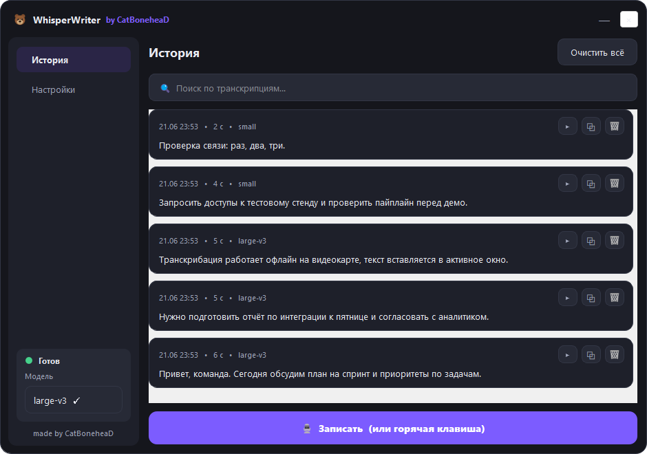
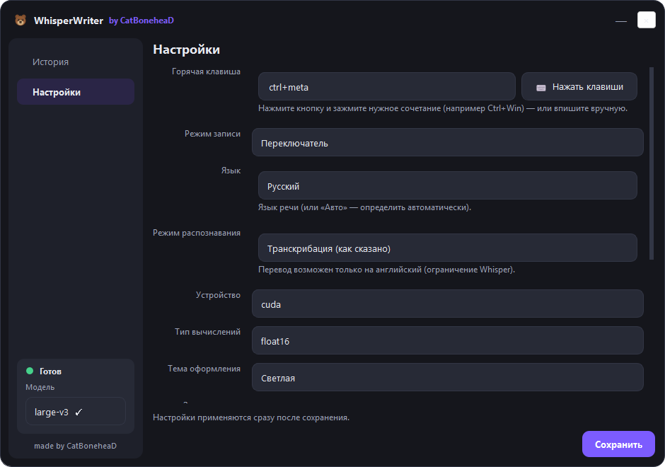

#  WhisperWriter <sub>by CatBoneheaD</sub>

  

**WhisperWriter** is a small speech-to-text app that uses [OpenAI's Whisper model](https://openai.com/research/whisper) (via [faster-whisper](https://github.com/SYSTRAN/faster-whisper/)) to transcribe your microphone straight into whatever window you're typing in. Press a hotkey, speak, and your words appear at the cursor.

This is a customized fork by **CatBoneheaD** — a modernized dark UI, transcription history, an in-app model switcher, a silent launcher (no console window), single-instance protection, and a hand-drawn bear icon. It builds on the excellent original [savbell/whisper-writer](https://github.com/savbell/whisper-writer) (see [Credits](#credits)).

> 🐻 Speak anywhere. Your text shows up where your cursor is.

<p align="center">
  
</p>
<p align="center">
  
</p>

## ✨ What's new in this fork

- **Modern dashboard** (Voice Ink-style) with **dark & light themes** — sidebar with History / Settings, live status indicator.
- **Transcription history** stored locally in SQLite — search, one-click copy, re-insert into the active window, delete.
- **In-app model switcher** — full multilingual set (tiny…large-v3); not-installed models download on selection (with a progress indicator).
- **Language picker & translation** — choose the spoken language from a list, or translate speech to English.
- **Text post-processing** — spoken-command replacements (`новая строка => \n`, `точка => .`), auto-capitalization, trailing space.
- **Settings UI** — hotkey (with a **press-to-capture** button), recording mode, language, device, theme, autostart and more — no YAML required. Changes apply **without restarting**.
- **Start with Windows** (optional) and **silent launch** via `launch.vbs` (no console window); lives in the system tray.
- **Single-instance guard** — a second launch won't start a duplicate (no more doubled text).
- **Proper taskbar icon** + custom bear icon (`assets/bear.svg`, rendered to PNG/ICO). ✕ hides to tray, minimize keeps it in the taskbar.

## 🎙 Recording modes

- `continuous` *(default)*: stops after a pause, transcribes, then keeps listening. Press the hotkey again to stop.
- `voice_activity_detection`: stops after a pause; won't restart until you press the hotkey.
- `press_to_toggle`: starts on hotkey, stops on the next hotkey press.
- `hold_to_record`: records while the hotkey is held down.

Transcription runs **locally** by default (faster-whisper), or through the **OpenAI API** if you enable it in Settings.

## 🚀 Getting started

### Prerequisites
- [Git](https://git-scm.com/downloads)
- [Python 3.11](https://www.python.org/downloads/)
- *(Optional, for GPU)* an NVIDIA GPU. The required `nvidia-cublas-cu12` and `nvidia-cudnn-cu12` libraries are installed automatically via `requirements.txt`, and the app adds them to `PATH` at startup — no manual CUDA setup needed.

### Installation

```bash
# 1. Clone
git clone https://github.com/CatBoneheaD/whisper-writer
cd whisper-writer

# 2. Create and activate a virtual environment
python -m venv venv
venv\Scripts\activate        # Windows

# 3. Install dependencies
pip install -r requirements.txt

# 4. (Optional) Pre-download a local model
python download_model.py

# 5. Run
python run.py
```

### Launch without a console (recommended)
Double-click **`launch.vbs`** — it starts the app silently with `pythonw.exe` (no console window). You can create a desktop shortcut to `launch.vbs` and set its icon to `assets/ww-logo.ico`.

> **Быстрый старт (RU):** установите Python 3.11, выполните шаги 1–3 выше, затем запускайте двойным кликом по `launch.vbs`. Горячая клавиша по умолчанию — `Ctrl+Shift+Space`. Модель и горячую клавишу можно поменять в окне «Настройки».

## ⚙️ Configuration

Everything can be set in the in-app **Settings** page. Settings are saved to `config.yaml` (this file is git-ignored, so your personal config stays local). If a value is missing, sensible defaults from `src/config_schema.yaml` are used.

<p align="center">
  
</p>

<details>
<summary>Full list of options</summary>

#### Model
- `use_api`: use the OpenAI API instead of a local model. (Default: `false`)
- `common.language`: ISO-639-1 language code (e.g. `en`, `ru`). (Default: `null` = auto)
- `common.temperature`: sampling temperature. (Default: `0.0`)
- `common.initial_prompt`: optional prompt to bias the transcription.
- `api.model` / `api.base_url` / `api.api_key`: OpenAI (or compatible) API settings.
- `local.model`: Whisper model name (`tiny`…`large-v3`). (Default: `base`)
- `local.device`: `cuda`, `cpu`, or `auto`. (Default: `auto`)
- `local.compute_type`: `default`, `float32`, `float16`, `int8`.
- `local.condition_on_previous_text`, `local.vad_filter`, `local.model_path`.

#### Recording
- `activation_key`: hotkey, keys joined with `+` (Default: `ctrl+shift+space`).
- `recording_mode`: `continuous` / `voice_activity_detection` / `press_to_toggle` / `hold_to_record`.
- `sound_device`, `sample_rate`, `silence_duration`, `min_duration`, `input_backend`.

#### Post-processing
- `add_trailing_space`, `remove_trailing_period`, `remove_capitalization`, `writing_key_press_delay`, `input_method`.

#### Misc
- `print_to_terminal`, `hide_status_window`, `noise_on_completion`.

</details>

## 📂 Project layout

```
run.py                     # Entry point (CUDA PATH setup + single-process launch)
launch.vbs                 # Silent launcher (no console)
src/main.py                # App orchestration, tray, single-instance, model switching
src/ui/dashboard_window.py # Dark dashboard (history, settings, model picker)
src/ui/theme.py            # Dark theme (palette + QSS)
src/ui/status_window.py    # Floating recording indicator
src/history.py             # SQLite transcription history
src/models.py              # Detect installed models from the HF cache
src/transcription.py       # faster-whisper / OpenAI transcription
src/key_listener.py        # Global hotkey handling
src/input_simulation.py    # Types the text into the active window
assets/bear.svg            # Icon source  →  assets/_build_icon.py  →  ww-logo.png / ww-logo.ico
```

## 🙏 Credits

This project is a fork of **[savbell/whisper-writer](https://github.com/savbell/whisper-writer)** — huge thanks to [savbell](https://github.com/savbell) and all original contributors. It also stands on:

- [OpenAI](https://openai.com/) — the Whisper model.
- [SYSTRAN / faster-whisper](https://github.com/SYSTRAN/faster-whisper) — fast local inference.

Fork modifications, UI redesign and bear icon by **CatBoneheaD**.

## 📜 License

This project is licensed under the **GNU General Public License v3.0**, the same license as the original project. You are free to use, modify, and redistribute it, provided derivative works remain under GPLv3 and preserve attribution. See the [LICENSE](LICENSE) file for details.
